# Color Game Statistics

This simulates the E-casino game called Color Game, a famous game for most Filipinos. In this game, there are three 6-sided dic, each comprises of the colors Red, Yellow, Blue, Green, Pink, and White. You can bet any of the colors as much as you want and if one of the dice rolled the color you've picked, you will get twice what you bet. If two of them showed up, you'll get triple. If three of the dice gives only the color you chose, you'll win quadruple of the bet. In this simulation, we process different betting strategies (Martingale, Constant, +/-10, etc.) and see if we can come up with definitive results. 


```python
import numpy as np
import matplotlib.pyplot as plt 
import random 
from collections import Counter
```

### Martingale Strategy
The entire process will run around 100000 times. Here's the algorithm:
- Budget: 1000 Pesos
- Starting bet: 10 Pesos
- Pick any (one, two, three) random colors in the color set.
    - If won, do the same process.
    - If lost, double the bet.
- If the budget is now lower than the amount of bet, all-in.


```python
def martingale_color_game(num_simul, budg, base_bet, num_col, rounds):
    scenario = []
    for j in range(num_simul):
        # money
        budget = budg
        bet = base_bet

        # list all the colors
        colors = ["R", "Y", "W", "B", "G", "P"]

        # data
        money_after_round = []
        time_steps = []

        # iterate the process of gambling
        for i in range(rounds):
            money_after_round.append(budget)
            time_steps.append(i+1)
            # check if the budget goes below zero
            if budget > 0:
                if (budget - bet*num_col) <= 0:
                    bet = budget
                    budget = budget - bet
                else:
                    budget = budget - bet*num_col
            else:
                break
            occurrence_count = {}
            # subtract the budget to the amount bet
            random_pick = random.choices(colors, k=num_col) # pick a color
            random_outcome = random.choices(colors, k=3) # pick three outcomes
            # check if each outcome color is in the chosen color
            for color in random_outcome:
                if color in random_pick:
                    if color in occurrence_count:
                        occurrence_count[color] += 1
                    else:
                        occurrence_count[color] = 1

            # if the dictionary is not empty, there is a common element
            if len(occurrence_count) != 0:
                total = 0
                col_occurrence = [occurrence_count.get(color, 0) for color in random_pick]
                for count in col_occurrence:
                    if count > 0:
                        total += bet * (count+1)
                budget = budget + total
                bet = base_bet # we have to go back to our original bet since we won
            else:
                bet = bet*2 # if not, we double our bet
        
        scenario.append(budget)
    return scenario
```

### Reverse Martingale strategy with 1-color bet


```python
# initial conditions scenario 1
num_simul = 100000
budget = 1000
base_bet = 10
num_col = 1
rounds = 10

scenario = martingale_color_game(num_simul, budget, base_bet, num_col, rounds)

plt.figure(figsize=(10, 6), dpi=100)
plt.grid(True, alpha = 0.2)
plt.hist(scenario, bins=20, color = 'black', edgecolor = 'black')
plt.title(f"{num_simul} simulations each with {rounds} rounds and {num_col}-color bet of Color Game (x0 = {budget}, bet = {base_bet}) using Martingale")
plt.xlabel("Net amount")
plt.xlim(left=0)
plt.ylabel("Frequency")

```


    Text(0, 0.5, 'Frequency')


    
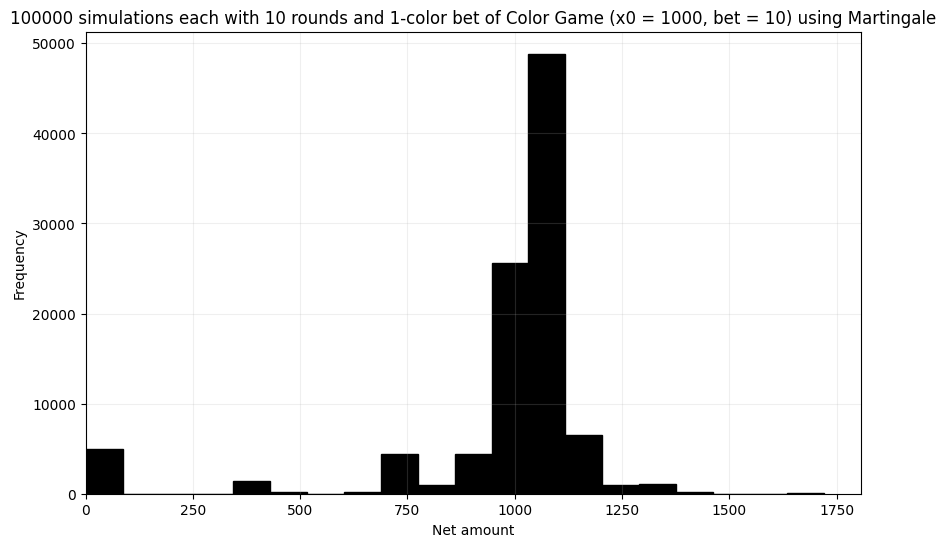
    


```python
# initial conditions scenario 2
num_simul = 100000
budget = 1000
base_bet = 10
num_col = 1
rounds = 25

scenario = martingale_color_game(num_simul, budget, base_bet, num_col, rounds)

plt.figure(figsize=(10, 6), dpi=100)
plt.grid(True, alpha = 0.2)
plt.hist(scenario, bins=20, color = 'black', edgecolor = 'black')
plt.title(f"{num_simul} simulations each with {rounds} rounds and {num_col}-color bet of Color Game (x0 = {budget}, bet = {base_bet}) using Martingale")
plt.xlabel("Net amount")
plt.xlim(left=0)
plt.ylabel("Frequency")

```


    Text(0, 0.5, 'Frequency')


    
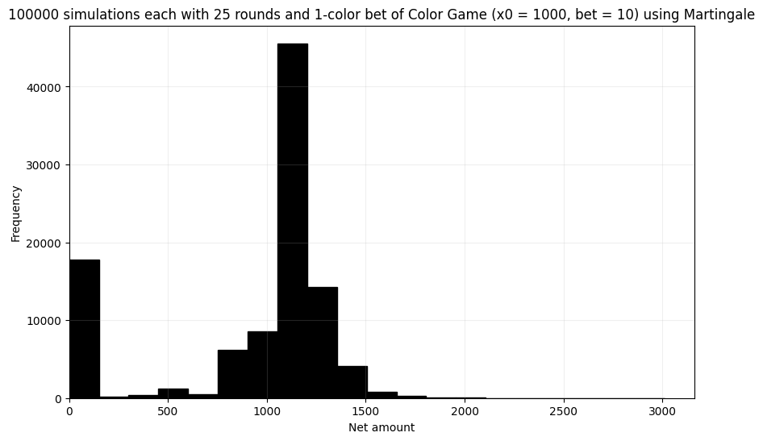
    


```python
# initial conditions scenario 3
num_simul = 100000
budget = 1000
base_bet = 10
num_col = 1
rounds = 50

scenario = martingale_color_game(num_simul, budget, base_bet, num_col, rounds)

plt.figure(figsize=(10, 6), dpi=100)
plt.grid(True, alpha = 0.2)
plt.hist(scenario, bins=20, color = 'black', edgecolor = 'black')
plt.title(f"{num_simul} simulations each with {rounds} rounds and {num_col}-color bet of Color Game (x0 = {budget}, bet = {base_bet}) using Martingale")
plt.xlabel("Net amount")
plt.xlim(left=0)
plt.ylabel("Frequency")
```


    Text(0, 0.5, 'Frequency')


    
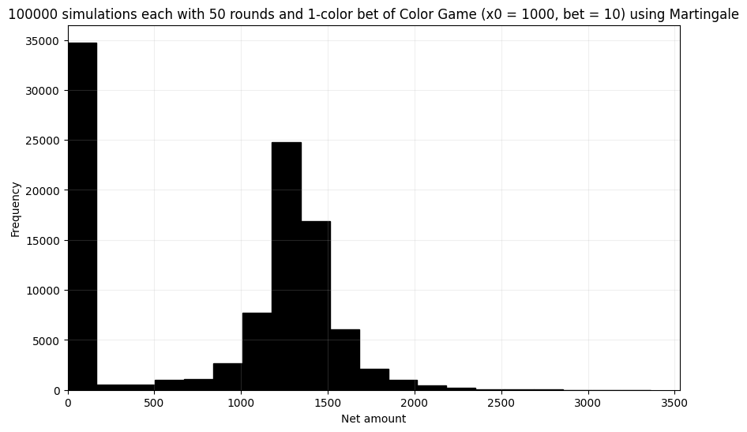
    


### Reverse Martingale strategy with 2-color bet


```python
# initial conditions scenario 1
num_simul = 100000
budget = 1000
base_bet = 10
num_col = 2
rounds = 10

scenario = martingale_color_game(num_simul, budget, base_bet, num_col, rounds)

plt.figure(figsize=(10, 6), dpi=100)
plt.grid(True, alpha = 0.2)
plt.hist(scenario, bins=20, color = 'black', edgecolor = 'black')
plt.title(f"{num_simul} simulations each with {rounds} rounds and {num_col}-color bet of Color Game (x0 = {budget}, bet = {base_bet}) using Martingale")
plt.xlabel("Net amount")
plt.xlim(left=0)
plt.ylabel("Frequency")
```


    Text(0, 0.5, 'Frequency')


    
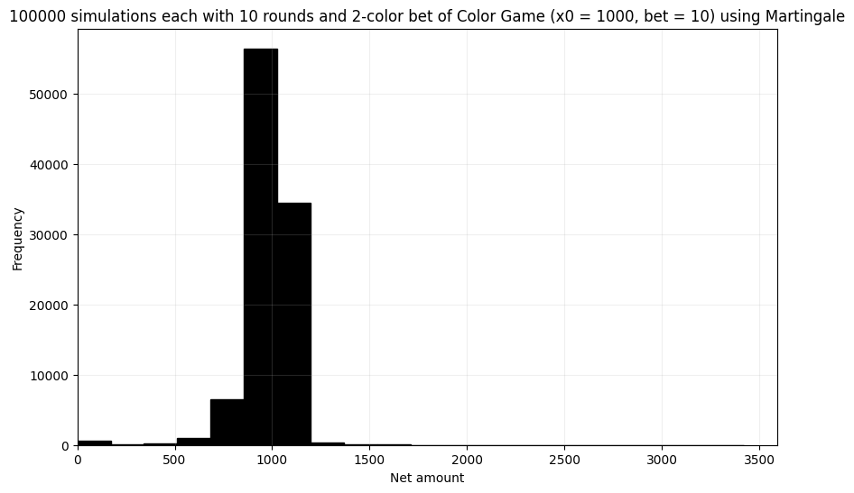
    


```python
# initial conditions scenario 2
num_simul = 100000
budget = 1000
base_bet = 10
num_col = 2
rounds = 25

scenario = martingale_color_game(num_simul, budget, base_bet, num_col, rounds)

plt.figure(figsize=(10, 6), dpi=100)
plt.grid(True, alpha = 0.2)
plt.hist(scenario, bins=20, color = 'black', edgecolor = 'black')
plt.title(f"{num_simul} simulations each with {rounds} rounds and {num_col}-color bet of Color Game (x0 = {budget}, bet = {base_bet}) using Martingale")
plt.xlabel("Net amount")
plt.xlim(left=0)
plt.ylabel("Frequency")
```


    Text(0, 0.5, 'Frequency')


    
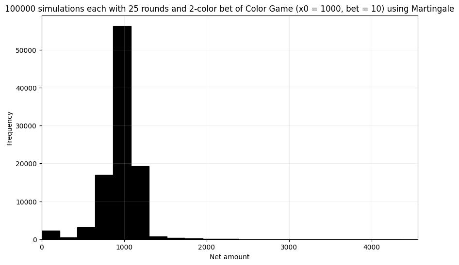
    


```python
# initial conditions scenario 3
num_simul = 100000
budget = 1000
base_bet = 10
num_col = 2
rounds = 50

scenario = martingale_color_game(num_simul, budget, base_bet, num_col, rounds)

plt.figure(figsize=(10, 6), dpi=100)
plt.grid(True, alpha = 0.2)
plt.hist(scenario, bins=20, color = 'black', edgecolor = 'black')
plt.title(f"{num_simul} simulations each with {rounds} rounds and {num_col}-color bet of Color Game (x0 = {budget}, bet = {base_bet}) using Martingale")
plt.xlabel("Net amount")
plt.xlim(left=0)
plt.ylabel("Frequency")
```


    Text(0, 0.5, 'Frequency')


    
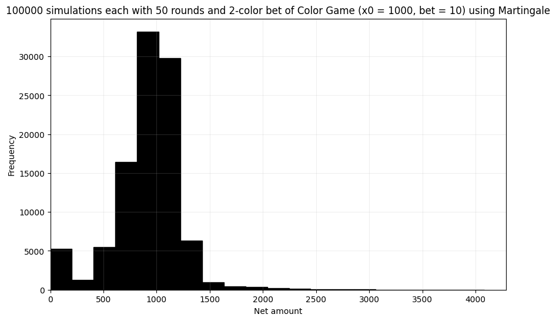
    


### Reverse Martingale strategy with 3-color bet


```python
# initial conditions scenario 1
num_simul = 100000
budget = 1000
base_bet = 10
num_col = 3
rounds = 10

scenario = martingale_color_game(num_simul, budget, base_bet, num_col, rounds)

plt.figure(figsize=(10, 6), dpi=100)
plt.grid(True, alpha = 0.2)
plt.hist(scenario, bins=20, color = 'black', edgecolor = 'black')
plt.title(f"{num_simul} simulations each with {rounds} rounds and {num_col}-color bet of Color Game (x0 = {budget}, bet = {base_bet}) using Martingale")
plt.xlabel("Net amount")
plt.xlim(left=0)
plt.ylabel("Frequency")
```


    Text(0, 0.5, 'Frequency')


    
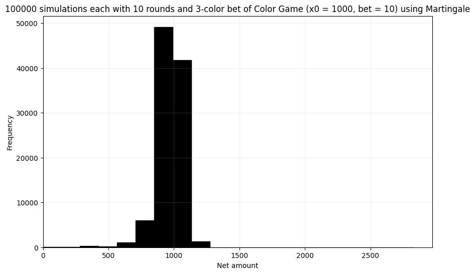
    


```python
# initial conditions scenario 2
num_simul = 100000
budget = 1000
base_bet = 10
num_col = 3
rounds = 25

scenario = martingale_color_game(num_simul, budget, base_bet, num_col, rounds)

plt.figure(figsize=(10, 6), dpi=100)
plt.grid(True, alpha = 0.2)
plt.hist(scenario, bins=20, color = 'black', edgecolor = 'black')
plt.title(f"{num_simul} simulations each with {rounds} rounds and {num_col}-color bet of Color Game (x0 = {budget}, bet = {base_bet}) using Martingale")
plt.xlabel("Net amount")
plt.xlim(left=0)
plt.ylabel("Frequency")
```


    Text(0, 0.5, 'Frequency')


    
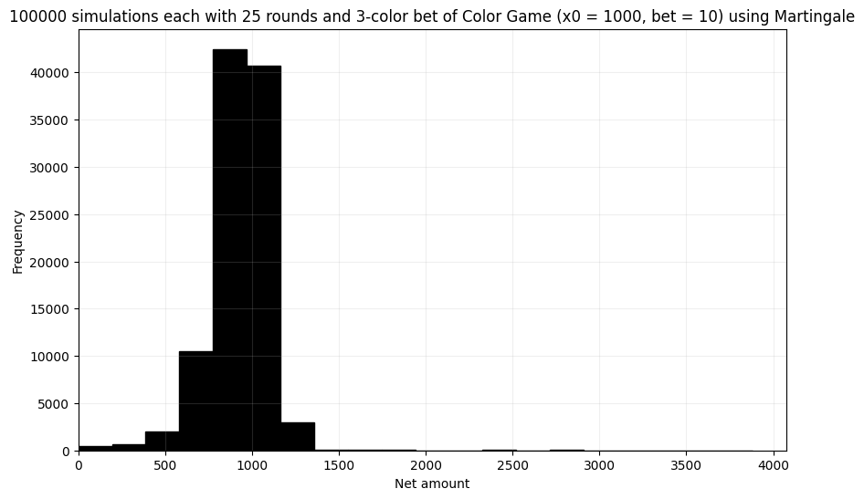
    


```python
# initial conditions scenario 3
num_simul = 100000
budget = 1000
base_bet = 10
num_col = 3
rounds = 50

scenario = martingale_color_game(num_simul, budget, base_bet, num_col, rounds)

plt.figure(figsize=(10, 6), dpi=100)
plt.grid(True, alpha = 0.2)
plt.hist(scenario, bins=20, color = 'black', edgecolor = 'black')
plt.title(f"{num_simul} simulations each with {rounds} rounds and {num_col}-color bet of Color Game (x0 = {budget}, bet = {base_bet}) using Martingale")
plt.xlabel("Net amount")
plt.xlim(left=0)
plt.ylabel("Frequency")
```


    Text(0, 0.5, 'Frequency')


    
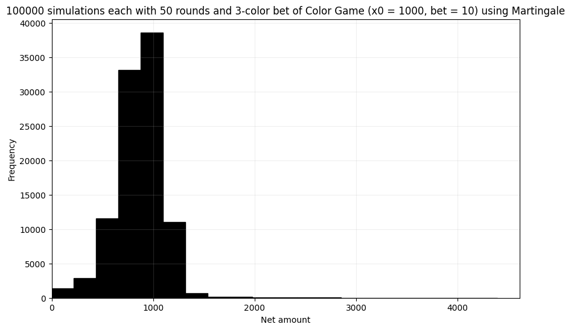
    


## Reverse Martingale Strategy
The entire process will run around 100000 times. Here's the algorithm:
- Budget: 1000 Pesos
- Starting bet: 10 Pesos
- Pick any (one, two, three) random colors in the color set.
    - If won, double the bet.
    - If lost, go back to the original bet.
- If the budget is now lower than the amount of bet, all-in.


```python
def reverse_martingale_color_game(num_simul, budg, base_bet, num_col, rounds):
    scenario = []
    for j in range(num_simul):
        # money
        budget = budg
        bet = base_bet

        # list all the colors
        colors = ["R", "Y", "W", "B", "G", "P"]

        # data
        money_after_round = []
        time_steps = []

        # iterate the process of gambling
        for i in range(rounds):
            money_after_round.append(budget)
            time_steps.append(i+1)
            # check if the budget goes below zero
            if budget > 0:
                if (budget - bet*num_col) <= 0:
                    bet = budget
                    budget = budget - bet
                else:
                    budget = budget - bet*num_col
            else:
                break
            occurrence_count = {}
            # subtract the budget to the amount bet
            random_pick = random.choices(colors, k=num_col) # pick a color
            random_outcome = random.choices(colors, k=3) # pick three outcomes
            # check if each outcome color is in the chosen color
            for color in random_outcome:
                if color in random_pick:
                    if color in occurrence_count:
                        occurrence_count[color] += 1
                    else:
                        occurrence_count[color] = 1

            # if the dictionary is not empty, there is a common element
            if len(occurrence_count) != 0:
                total = 0
                col_occurrence = [occurrence_count.get(color, 0) for color in random_pick]
                for count in col_occurrence:
                    if count > 0:
                        total += bet * (count+1)
                budget = budget + total
                bet = bet*2 # double the bet
            else:
                bet = base_bet # go back to the base bet
        
        scenario.append(budget)
    return scenario
```

### Reverse Martingale strategy with 1-color bet


```python
# initial conditions scenario 1
num_simul = 100000
budget = 1000
base_bet = 10
num_col = 1
rounds = 5

scenario = reverse_martingale_color_game(num_simul, budget, base_bet, num_col, rounds)

plt.figure(figsize=(10, 6), dpi=100)
plt.grid(True, alpha = 0.2)
plt.hist(scenario, bins=20, color = 'black', edgecolor = 'black')
plt.title(f"{num_simul} simulations each with {rounds} rounds and {num_col}-color bet of Color Game (x0 = {budget}, bet = {base_bet}) using Reverse Martingale")
plt.xlabel("Net amount")
plt.xlim(left=0)
plt.ylabel("Frequency")
```


    Text(0, 0.5, 'Frequency')


    
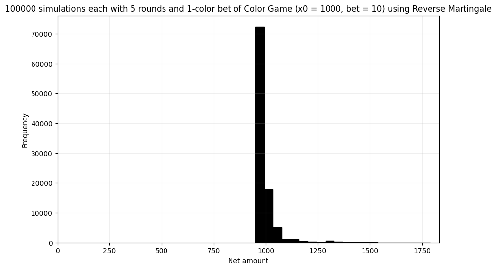
    


### Reverse Martingale strategy with 2-color bet


```python
# initial conditions scenario 2
num_simul = 100000
budget = 1000
base_bet = 10
num_col = 2
rounds = 5

scenario = reverse_martingale_color_game(num_simul, budget, base_bet, num_col, rounds)

plt.figure(figsize=(10, 6), dpi=100)
plt.grid(True, alpha = 0.2)
plt.hist(scenario, bins=20, color = 'black', edgecolor = 'black')
plt.title(f"{num_simul} simulations each with {rounds} rounds and {num_col}-color bet of Color Game (x0 = {budget}, bet = {base_bet}) using Reverse Martingale")
plt.xlabel("Net amount")
plt.xlim(left=0)
plt.ylabel("Frequency")
```


    Text(0, 0.5, 'Frequency')


    
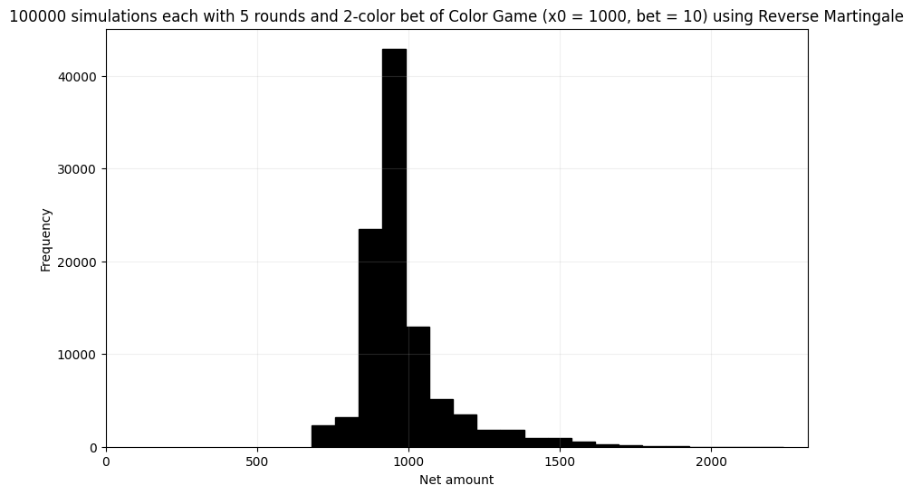
    


### Reverse Martingale strategy with 3-color bet


```python
# initial conditions scenario 3
num_simul = 100000
budget = 1000
base_bet = 10
num_col = 3
rounds = 5

scenario = reverse_martingale_color_game(num_simul, budget, base_bet, num_col, rounds)

plt.figure(figsize=(10, 6), dpi=100)
plt.grid(True, alpha = 0.2)
plt.hist(scenario, bins=20, color = 'black', edgecolor = 'black')
plt.title(f"{num_simul} simulations each with {rounds} rounds and {num_col}-color bet of Color Game (x0 = {budget}, bet = {base_bet}) using Reverse Martingale")
plt.xlabel("Net amount")
plt.xlim(left=0)
plt.ylabel("Frequency")
```


    Text(0, 0.5, 'Frequency')


    
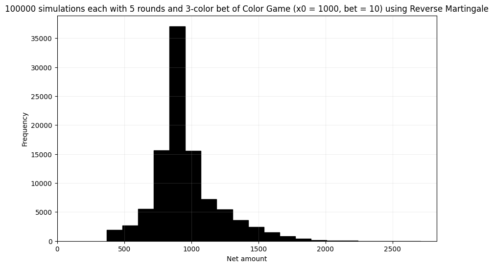
    


## Constant Betting Strategy
The entire process will run around 100000 times. Here's the algorithm:
- Budget: 1000 Pesos
- Starting bet: 10 Pesos
- Pick any (one, two, three) random colors in the color set.
    - If won, do the same process.
    - If lost, +original bet.
- If the budget is now lower than the amount of bet, all-in.


```python
def constant_bet_color_game(num_simul, budg, base_bet, num_col, rounds):
    scenario = []
    for j in range(num_simul):
        # money
        budget = budg
        bet = base_bet

        # list all the colors
        colors = ["R", "Y", "W", "B", "G", "P"]

        # data
        money_after_round = []
        time_steps = []

        # iterate the process of gambling
        for i in range(rounds):
            money_after_round.append(budget)
            time_steps.append(i+1)
            # check if the budget goes below zero
            if budget > 0:
                if (budget - bet*num_col) <= 0:
                    bet = budget
                    budget = budget - bet
                else:
                    budget = budget - bet*num_col
            else:
                break
            occurrence_count = {}
            # subtract the budget to the amount bet
            random_pick = random.choices(colors, k=num_col) # pick a color
            random_outcome = random.choices(colors, k=3) # pick three outcomes
            # check if each outcome color is in the chosen color
            for color in random_outcome:
                if color in random_pick:
                    if color in occurrence_count:
                        occurrence_count[color] += 1
                    else:
                        occurrence_count[color] = 1

            # if the dictionary is not empty, there is a common element
            if len(occurrence_count) != 0:
                total = 0
                col_occurrence = [occurrence_count.get(color, 0) for color in random_pick]
                for count in col_occurrence:
                    if count > 0:
                        total += bet * (count+1)
                budget = budget + total
                bet = base_bet # double the bet
            else:
                bet = bet+base_bet # go back to the base bet
        
        scenario.append(budget)
    return scenario
```

### Constant betting with 1-color bet


```python
# initial conditions scenario 1
num_simul = 100000
budget = 1000
base_bet = 10
num_col = 1
rounds = 10

scenario = constant_bet_color_game(num_simul, budget, base_bet, num_col, rounds)

plt.figure(figsize=(10, 6), dpi=100)
plt.grid(True, alpha = 0.2)
plt.hist(scenario, bins=20, color = 'black', edgecolor = 'black')
plt.title(f"{num_simul} simulations each with {rounds} rounds and {num_col}-color bet of Color Game (x0 = {budget}, bet = {base_bet}) using Constant Betting")
plt.xlabel("Net amount")
plt.xlim(left=0)
plt.ylabel("Frequency")

```


    Text(0, 0.5, 'Frequency')


    
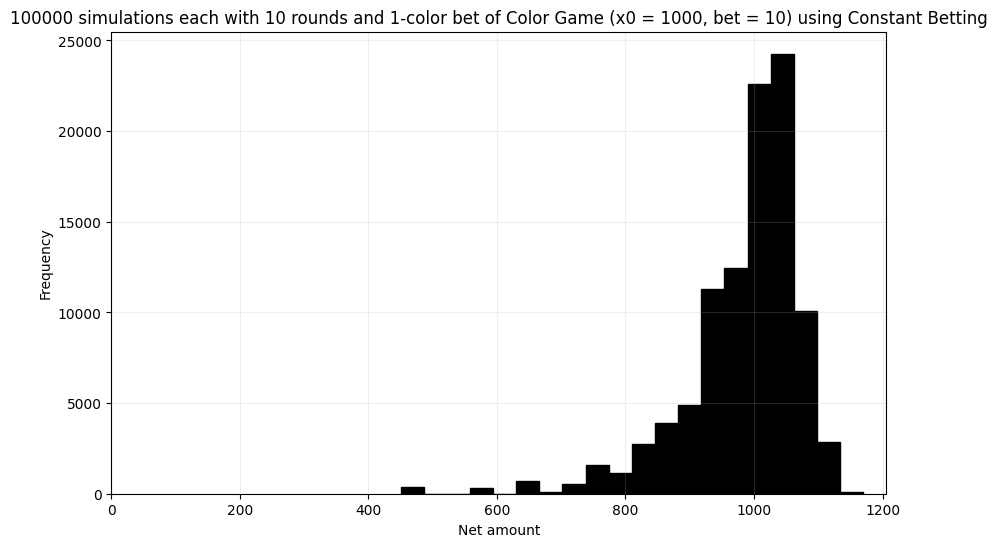
    


```python
# initial conditions scenario 2
num_simul = 100000
budget = 1000
base_bet = 10
num_col = 1
rounds = 25

scenario = constant_bet_color_game(num_simul, budget, base_bet, num_col, rounds)

plt.figure(figsize=(10, 6), dpi=100)
plt.grid(True, alpha = 0.2)
plt.hist(scenario, bins=20, color = 'black', edgecolor = 'black')
plt.title(f"{num_simul} simulations each with {rounds} rounds and {num_col}-color bet of Color Game (x0 = {budget}, bet = {base_bet}) using Constant Betting")
plt.xlabel("Net amount")
plt.xlim(left=0)
plt.ylabel("Frequency")
```


    Text(0, 0.5, 'Frequency')


    
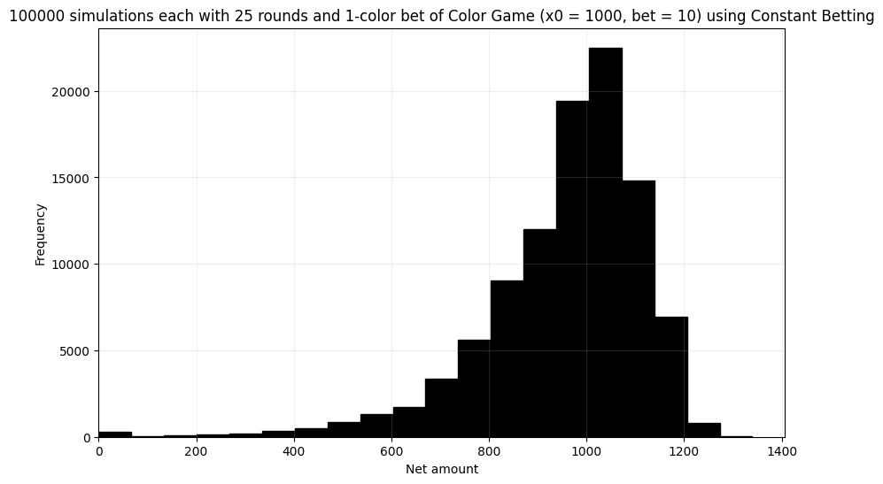
    


```python
# initial conditions scenario 3
num_simul = 100000
budget = 1000
base_bet = 10
num_col = 1
rounds = 50

scenario = constant_bet_color_game(num_simul, budget, base_bet, num_col, rounds)

plt.figure(figsize=(10, 6), dpi=100)
plt.grid(True, alpha = 0.2)
plt.hist(scenario, bins=20, color = 'black', edgecolor = 'black')
plt.title(f"{num_simul} simulations each with {rounds} rounds and {num_col}-color bet of Color Game (x0 = {budget}, bet = {base_bet}) using Constant Betting")
plt.xlabel("Net amount")
plt.xlim(left=0)
plt.ylabel("Frequency")
```


    Text(0, 0.5, 'Frequency')


    
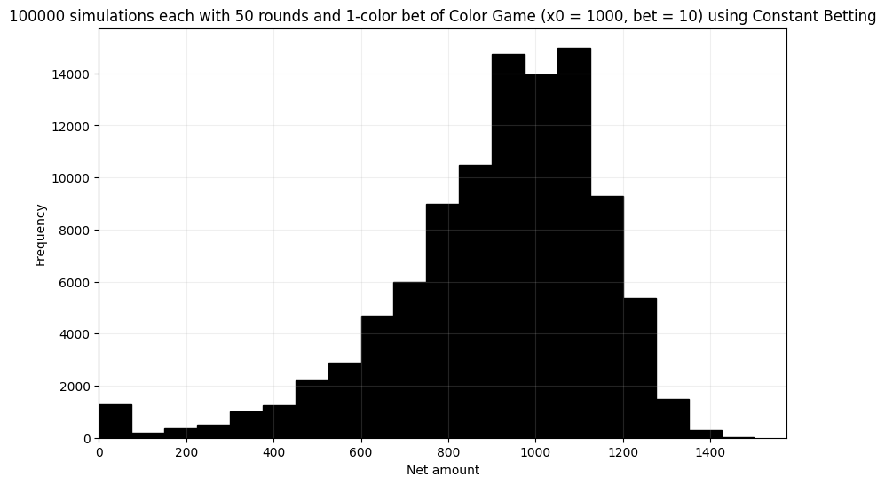
    


### Constant betting with 2-color bet


```python
# initial conditions scenario 1
num_simul = 100000
budget = 1000
base_bet = 10
num_col = 2
rounds = 10

scenario = constant_bet_color_game(num_simul, budget, base_bet, num_col, rounds)

plt.figure(figsize=(10, 6), dpi=100)
plt.grid(True, alpha = 0.2)
plt.hist(scenario, bins=20, color = 'black', edgecolor = 'black')
plt.title(f"{num_simul} simulations each with {rounds} rounds and {num_col}-color bet of Color Game (x0 = {budget}, bet = {base_bet}) using Constant Betting")
plt.xlabel("Net amount")
plt.xlim(left=0)
plt.ylabel("Frequency")
```


    Text(0, 0.5, 'Frequency')


    
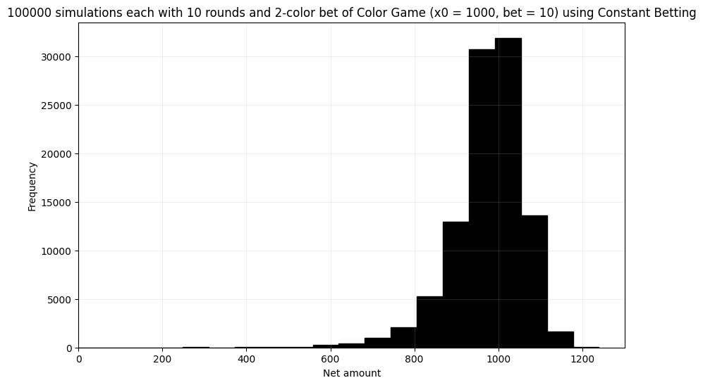
    


```python
# initial conditions scenario 2
num_simul = 100000
budget = 1000
base_bet = 10
num_col = 2
rounds = 25

scenario = constant_bet_color_game(num_simul, budget, base_bet, num_col, rounds)

plt.figure(figsize=(10, 6), dpi=100)
plt.grid(True, alpha = 0.2)
plt.hist(scenario, bins=20, color = 'black', edgecolor = 'black')
plt.title(f"{num_simul} simulations each with {rounds} rounds and {num_col}-color bet of Color Game (x0 = {budget}, bet = {base_bet}) using Constant Betting")
plt.xlabel("Net amount")
plt.xlim(left=0)
plt.ylabel("Frequency")
```


    Text(0, 0.5, 'Frequency')


    
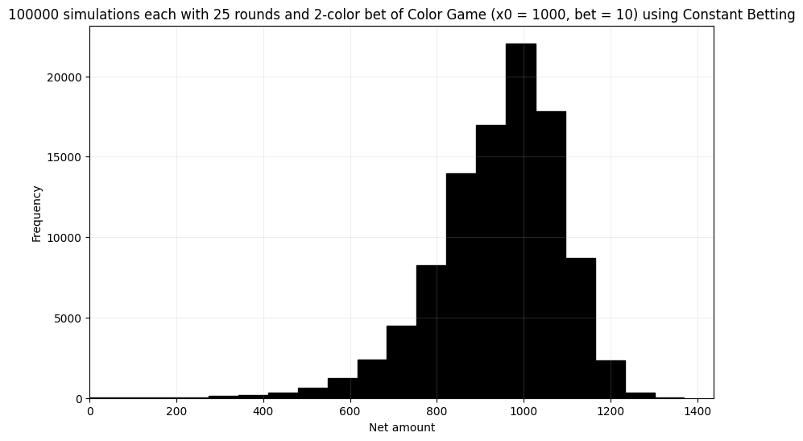
    


```python
# initial conditions scenario 3
num_simul = 100000
budget = 1000
base_bet = 10
num_col = 2
rounds = 50

scenario = constant_bet_color_game(num_simul, budget, base_bet, num_col, rounds)

plt.figure(figsize=(10, 6), dpi=100)
plt.grid(True, alpha = 0.2)
plt.hist(scenario, bins=20, color = 'black', edgecolor = 'black')
plt.title(f"{num_simul} simulations each with {rounds} rounds and {num_col}-color bet of Color Game (x0 = {budget}, bet = {base_bet}) using Constant Betting")
plt.xlabel("Net amount")
plt.xlim(left=0)
plt.ylabel("Frequency")
```


    Text(0, 0.5, 'Frequency')


    
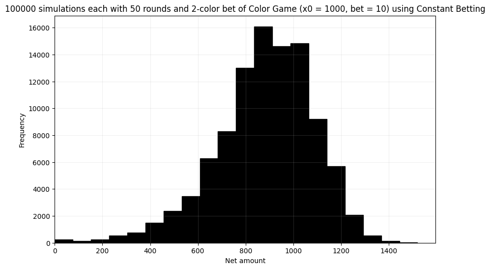
    


### Constant betting with 3-color bet


```python
# initial conditions scenario 1
num_simul = 100000
budget = 1000
base_bet = 10
num_col = 3
rounds = 10

scenario = constant_bet_color_game(num_simul, budget, base_bet, num_col, rounds)

plt.figure(figsize=(10, 6), dpi=100)
plt.grid(True, alpha = 0.2)
plt.hist(scenario, bins=20, color = 'black', edgecolor = 'black')
plt.title(f"{num_simul} simulations each with {rounds} rounds and {num_col}-color bet of Color Game (x0 = {budget}, bet = {base_bet}) using Constant Betting")
plt.xlabel("Net amount")
plt.xlim(left=0)
plt.ylabel("Frequency")
```


    Text(0, 0.5, 'Frequency')


    
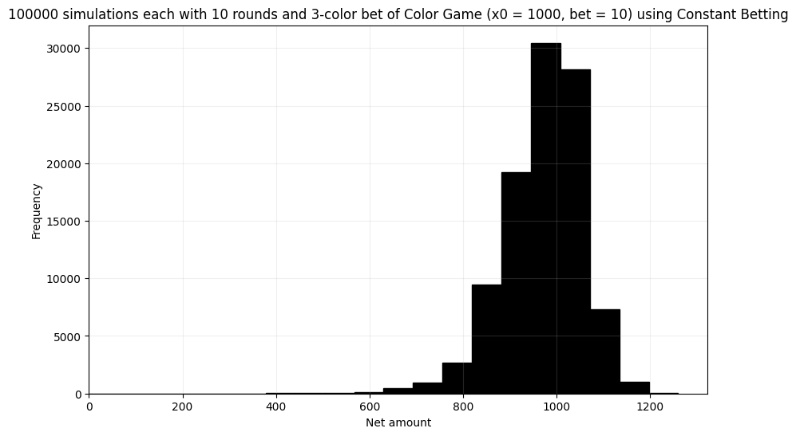
    


```python
# initial conditions scenario 2
num_simul = 100000
budget = 1000
base_bet = 10
num_col = 3
rounds = 25

scenario = constant_bet_color_game(num_simul, budget, base_bet, num_col, rounds)

plt.figure(figsize=(10, 6), dpi=100)
plt.grid(True, alpha = 0.2)
plt.hist(scenario, bins=20, color = 'black', edgecolor = 'black')
plt.title(f"{num_simul} simulations each with {rounds} rounds and {num_col}-color bet of Color Game (x0 = {budget}, bet = {base_bet}) using Constant Betting")
plt.xlabel("Net amount")
plt.xlim(left=0)
plt.ylabel("Frequency")
```


    Text(0, 0.5, 'Frequency')


    
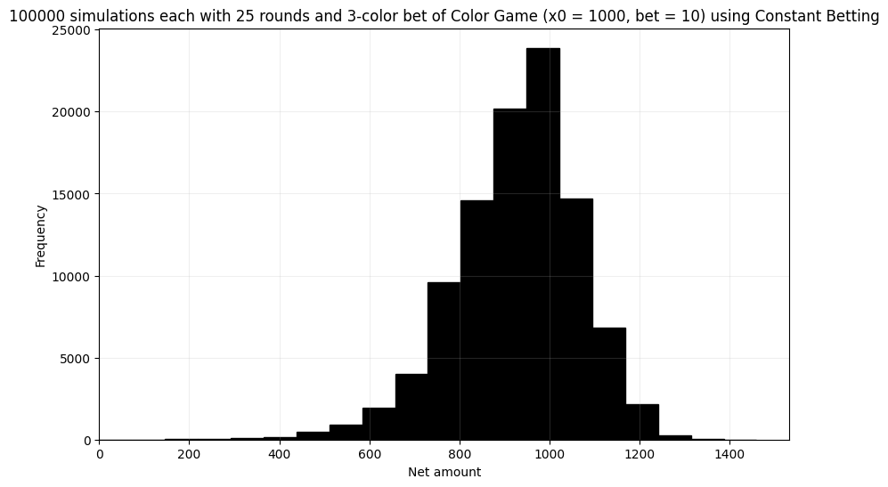
    


```python
# initial conditions scenario 3
num_simul = 100000
budget = 1000
base_bet = 10
num_col = 3
rounds = 50

scenario = constant_bet_color_game(num_simul, budget, base_bet, num_col, rounds)

plt.figure(figsize=(10, 6), dpi=100)
plt.grid(True, alpha = 0.2)
plt.hist(scenario, bins=20, color = 'black', edgecolor = 'black')
plt.title(f"{num_simul} simulations each with {rounds} rounds and {num_col}-color bet of Color Game (x0 = {budget}, bet = {base_bet}) using Constant Betting")
plt.xlabel("Net amount")
plt.xlim(left=0)
plt.ylabel("Frequency")
```


    Text(0, 0.5, 'Frequency')


    
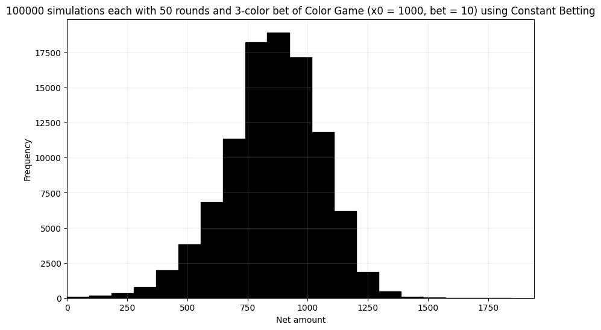
    


## Sample outputs using both Martingale and Constant betting


```python
# initial conditions
budget = 1000
base_bet = 10
num_col = 1
rounds = 50
bet = base_bet

# list all the colors
colors = ["R", "Y", "W", "B", "G", "P"]

# data
money_after_round = []
time_steps = []

# iterate the process of gambling
for i in range(rounds):
    money_after_round.append(budget)
    time_steps.append(i+1)
    # check if the budget goes below zero
    if budget > 0:
        if (budget - bet*num_col) <= 0:
            bet = budget
            budget = budget - bet
        else:
            budget = budget - bet*num_col
    else:
        break
    occurrence_count = {}
    # subtract the budget to the amount bet
    random_pick = random.choices(colors, k=num_col) # pick a color
    random_outcome = random.choices(colors, k=3) # pick three outcomes
    # check if each outcome color is in the chosen color
    for color in random_outcome:
        if color in random_pick:
            if color in occurrence_count:
                occurrence_count[color] += 1
            else:
                occurrence_count[color] = 1

    # if the dictionary is not empty, there is a common element
    if len(occurrence_count) != 0:
        total = 0
        col_occurrence = [occurrence_count.get(color, 0) for color in random_pick]
        for count in col_occurrence:
            if count > 0:
                total += bet * (count+1)
        budget = budget + total
        bet = base_bet # we have to go back to our original bet since we won
    else:
        bet = bet*2 # if not, we double our bet

budget = 1000
plt.figure(figsize=(10, 6), dpi=100)
plt.plot(time_steps, money_after_round, marker='o', color='k')
plt.grid(True, alpha = 0.2)
plt.title(f"{rounds} rounds and {num_col}-color bet of Color Game (x0 = {budget}, bet = {base_bet}) using Martingale")
plt.xlabel("Rounds")
plt.xlim(left=0)
plt.ylabel("Amount")
```


    Text(0, 0.5, 'Amount')


    
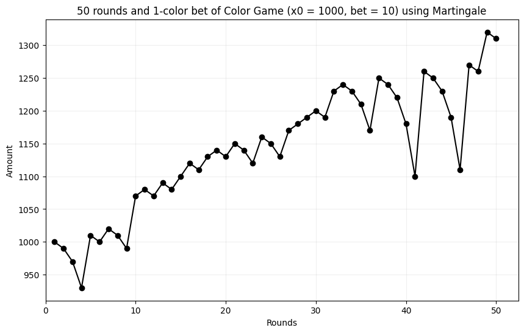
    


```python
# initial conditions
budget = 1000
base_bet = 10
num_col = 2
rounds = 50
bet = base_bet

# list all the colors
colors = ["R", "Y", "W", "B", "G", "P"]

# data
money_after_round = []
time_steps = []

# iterate the process of gambling
for i in range(rounds):
    money_after_round.append(budget)
    time_steps.append(i+1)
    # check if the budget goes below zero
    if budget > 0:
        if (budget - bet*num_col) <= 0:
            bet = budget
            budget = budget - bet
        else:
            budget = budget - bet*num_col
    else:
        break
    occurrence_count = {}
    # subtract the budget to the amount bet
    random_pick = random.choices(colors, k=num_col) # pick a color
    random_outcome = random.choices(colors, k=3) # pick three outcomes
    # check if each outcome color is in the chosen color
    for color in random_outcome:
        if color in random_pick:
            if color in occurrence_count:
                occurrence_count[color] += 1
            else:
                occurrence_count[color] = 1

    # if the dictionary is not empty, there is a common element
    if len(occurrence_count) != 0:
        total = 0
        col_occurrence = [occurrence_count.get(color, 0) for color in random_pick]
        for count in col_occurrence:
            if count > 0:
                total += bet * (count+1)
        budget = budget + total
        bet = base_bet # we have to go back to our original bet since we won
    else:
        bet = bet*2 # if not, we double our bet

budget = 1000
plt.figure(figsize=(10, 6), dpi=100)
plt.plot(time_steps, money_after_round, marker='o', color='k')
plt.grid(True, alpha = 0.2)
plt.title(f"{rounds} rounds and {num_col}-color bet of Color Game (x0 = {budget}, bet = {base_bet}) using Martingale")
plt.xlabel("Rounds")
plt.xlim(left=0)
plt.ylabel("Amount")
```


    Text(0, 0.5, 'Amount')


    
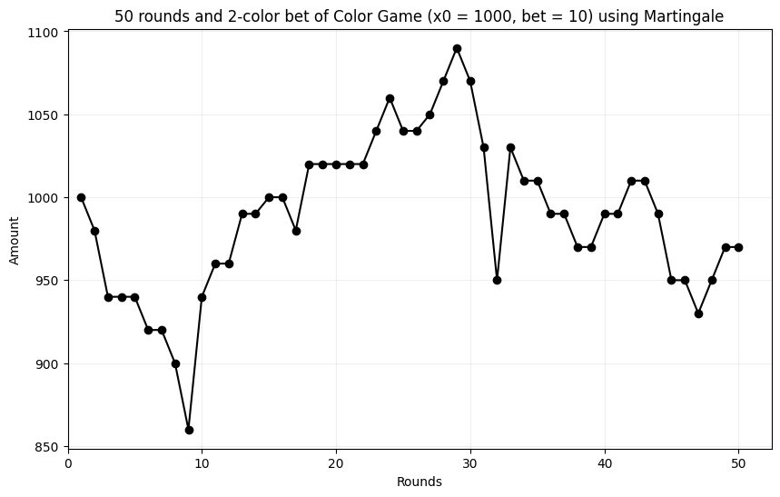
    


```python
# initial conditions
budget = 1000
base_bet = 10
num_col = 1
rounds = 50
bet = base_bet

# list all the colors
colors = ["R", "Y", "W", "B", "G", "P"]

# data
money_after_round = []
time_steps = []

# iterate the process of gambling
for i in range(rounds):
    money_after_round.append(budget)
    time_steps.append(i+1)
    # check if the budget goes below zero
    if budget > 0:
        if (budget - bet*num_col) <= 0:
            bet = budget
            budget = budget - bet
        else:
            budget = budget - bet*num_col
    else:
        break
    occurrence_count = {}
    # subtract the budget to the amount bet
    random_pick = random.choices(colors, k=num_col) # pick a color
    random_outcome = random.choices(colors, k=3) # pick three outcomes
    # check if each outcome color is in the chosen color
    for color in random_outcome:
        if color in random_pick:
            if color in occurrence_count:
                occurrence_count[color] += 1
            else:
                occurrence_count[color] = 1

    # if the dictionary is not empty, there is a common element
    if len(occurrence_count) != 0:
        total = 0
        col_occurrence = [occurrence_count.get(color, 0) for color in random_pick]
        for count in col_occurrence:
            if count > 0:
                total += bet * (count+1)
        budget = budget + total
        bet = base_bet # we have to go back to our original bet since we won
    else:
        bet = bet+base_bet # if not, we double our bet

budget = 1000
plt.figure(figsize=(10, 6), dpi=100)
plt.plot(time_steps, money_after_round, marker='o', color='k')
plt.grid(True, alpha = 0.2)
plt.title(f"{rounds} rounds and {num_col}-color bet of Color Game (x0 = {budget}, bet = {base_bet}) using Constant Betting")
plt.xlabel("Rounds")
plt.xlim(left=0)
plt.ylabel("Amount")
```


    Text(0, 0.5, 'Amount')


    
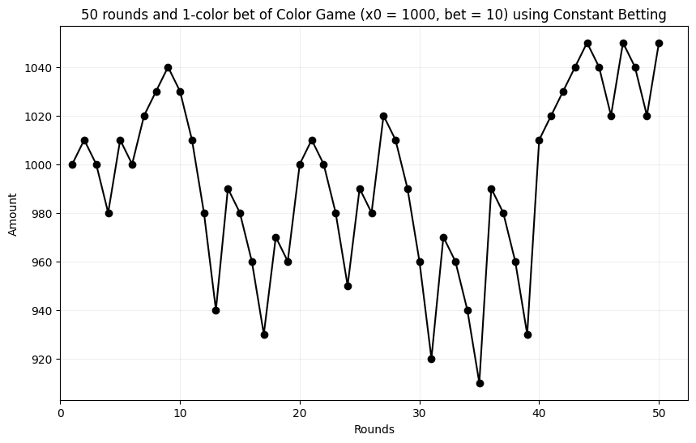
    


```python
# initial conditions
budget = 1000
base_bet = 10
num_col = 2
rounds = 50
bet = base_bet

# list all the colors
colors = ["R", "Y", "W", "B", "G", "P"]

# data
money_after_round = []
time_steps = []

# iterate the process of gambling
for i in range(rounds):
    money_after_round.append(budget)
    time_steps.append(i+1)
    # check if the budget goes below zero
    if budget > 0:
        if (budget - bet*num_col) <= 0:
            bet = budget
            budget = budget - bet
        else:
            budget = budget - bet*num_col
    else:
        break
    occurrence_count = {}
    # subtract the budget to the amount bet
    random_pick = random.choices(colors, k=num_col) # pick a color
    random_outcome = random.choices(colors, k=3) # pick three outcomes
    # check if each outcome color is in the chosen color
    for color in random_outcome:
        if color in random_pick:
            if color in occurrence_count:
                occurrence_count[color] += 1
            else:
                occurrence_count[color] = 1

    # if the dictionary is not empty, there is a common element
    if len(occurrence_count) != 0:
        total = 0
        col_occurrence = [occurrence_count.get(color, 0) for color in random_pick]
        for count in col_occurrence:
            if count > 0:
                total += bet * (count+1)
        budget = budget + total
        bet = base_bet # we have to go back to our original bet since we won
    else:
        bet = bet+base_bet # if not, we double our bet

budget = 1000
plt.figure(figsize=(10, 6), dpi=100)
plt.plot(time_steps, money_after_round, marker='o', color='k')
plt.grid(True, alpha = 0.2)
plt.title(f"{rounds} rounds and {num_col}-color bet of Color Game (x0 = {budget}, bet = {base_bet}) using Constant Betting")
plt.xlabel("Rounds")
plt.xlim(left=0)
plt.ylabel("Amount")
```


    Text(0, 0.5, 'Amount')


    
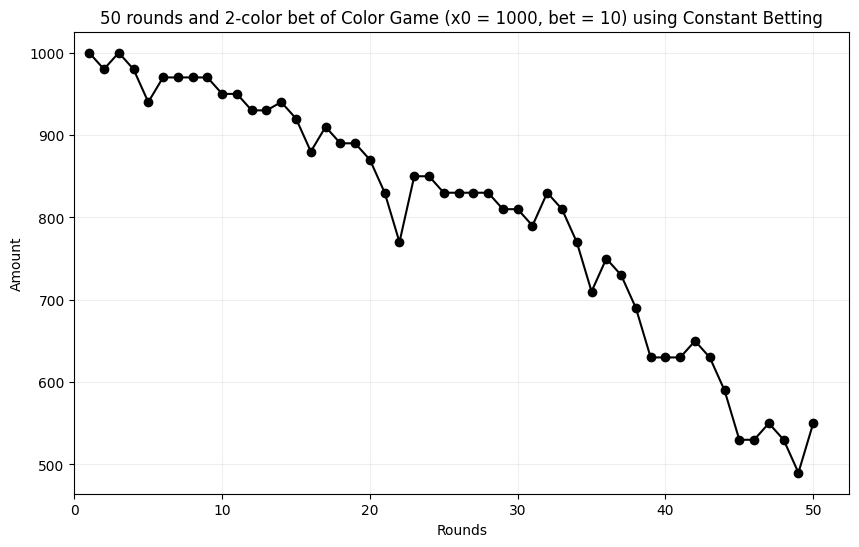
    


```python
# initial condition
budget = 1000
base_bet = 10
num_col = 1
rounds = 50
bet = base_bet

# list all the colors
colors = ["R", "Y", "W", "B", "G", "P"]

# data
money_after_round = []
time_steps = []

# iterate the process of gambling
for i in range(rounds):
    money_after_round.append(budget)
    time_steps.append(i+1)
    # check if the budget goes below zero
    if budget > 0:
        if (budget - bet*num_col) <= 0:
            bet = budget
            budget = budget - bet
        else:
            budget = budget - bet*num_col
    else:
        break
    occurrence_count = {}
    # subtract the budget to the amount bet
    random_pick = random.choices(colors, k=num_col) # pick a color
    random_outcome = random.choices(colors, k=3) # pick three outcomes
    # check if each outcome color is in the chosen color
    for color in random_outcome:
        if color in random_pick:
            if color in occurrence_count:
                occurrence_count[color] += 1
            else:
                occurrence_count[color] = 1

    # if the dictionary is not empty, there is a common element
    if len(occurrence_count) != 0:
        total = 0
        col_occurrence = [occurrence_count.get(color, 0) for color in random_pick]
        for count in col_occurrence:
            if count > 0:
                total += bet * (count+1)
        budget = budget + total
        bet = 2*bet # we have to go back to our original bet since we won
    else:
        bet = base_bet # if not, we double our bet

budget = 1000
plt.figure(figsize=(10, 6), dpi=100)
plt.plot(time_steps, money_after_round, marker='o', color='k')
plt.grid(True, alpha = 0.2)
plt.title(f"{rounds} rounds and {num_col}-color bet of Color Game (x0 = {budget}, bet = {base_bet}) using Reverse Martingale")
plt.xlabel("Rounds")
plt.xlim(left=0)
plt.ylabel("Amount")
```


    Text(0, 0.5, 'Amount')


    
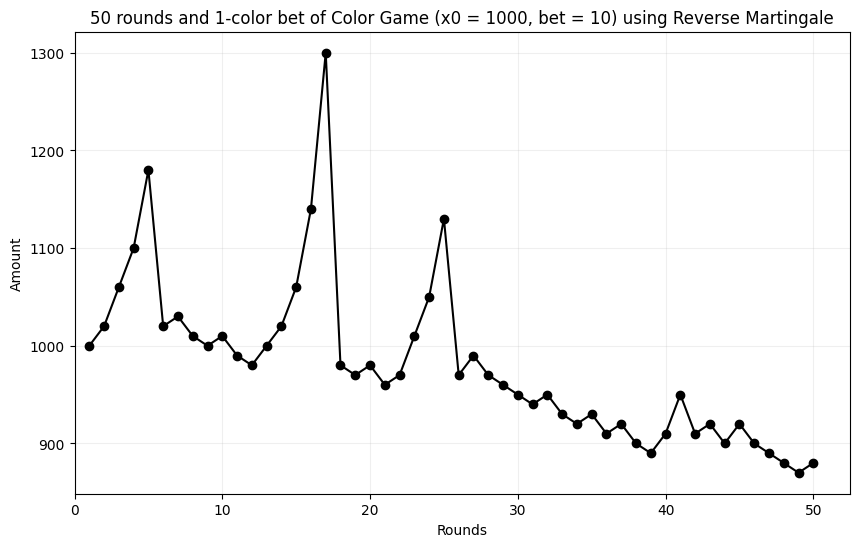
    


```python
# initial condition
budget = 1000
base_bet = 10
num_col = 2
rounds = 50
bet = base_bet

# list all the colors
colors = ["R", "Y", "W", "B", "G", "P"]

# data
money_after_round = []
time_steps = []

# iterate the process of gambling
for i in range(rounds):
    money_after_round.append(budget)
    time_steps.append(i+1)
    # check if the budget goes below zero
    if budget > 0:
        if (budget - bet*num_col) <= 0:
            bet = budget
            budget = budget - bet
        else:
            budget = budget - bet*num_col
    else:
        break
    occurrence_count = {}
    # subtract the budget to the amount bet
    random_pick = random.choices(colors, k=num_col) # pick a color
    random_outcome = random.choices(colors, k=3) # pick three outcomes
    # check if each outcome color is in the chosen color
    for color in random_outcome:
        if color in random_pick:
            if color in occurrence_count:
                occurrence_count[color] += 1
            else:
                occurrence_count[color] = 1

    # if the dictionary is not empty, there is a common element
    if len(occurrence_count) != 0:
        total = 0
        col_occurrence = [occurrence_count.get(color, 0) for color in random_pick]
        for count in col_occurrence:
            if count > 0:
                total += bet * (count+1)
        budget = budget + total
        bet = 2*bet # we have to go back to our original bet since we won
    else:
        bet = base_bet # if not, we double our bet

budget = 1000
plt.figure(figsize=(10, 6), dpi=100)
plt.plot(time_steps, money_after_round, marker='o', color='k')
plt.grid(True, alpha = 0.2)
plt.title(f"{rounds} rounds and {num_col}-color bet of Color Game (x0 = {budget}, bet = {base_bet}) using Reverse Martingale")
plt.xlabel("Rounds")
plt.xlim(left=0)
plt.ylabel("Amount")
```


    Text(0, 0.5, 'Amount')


    
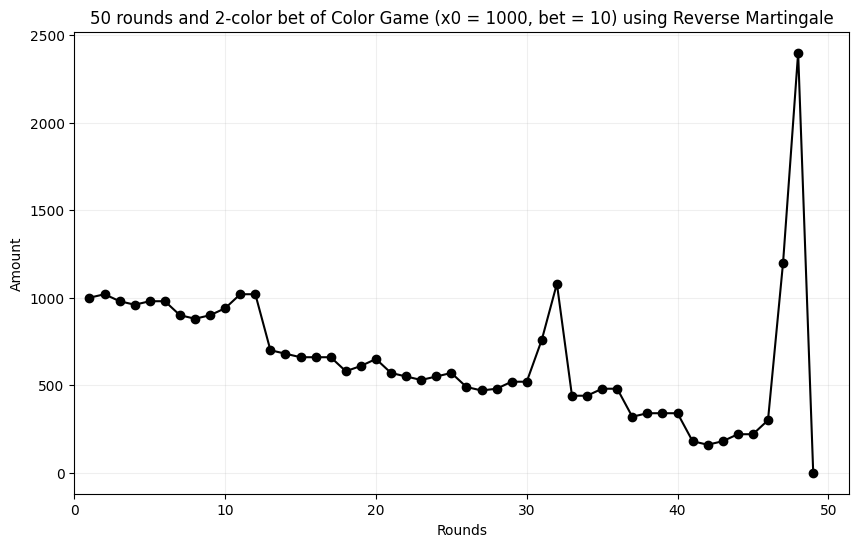
    


## Simulations of Colors within n rounds


```python
rounds = 20
colors = ["blue", "red", "yellow", "lightgray", "pink", "green"]
color_collection = []

for i in range(rounds):
    random_outcome = random.choices(colors, k=3)
    for col in random_outcome:
        color_collection.append(col)

data = Counter(color_collection)
colors = list(data.keys())
frequencies = list(data.values())

plt.figure(figsize=(10, 6), dpi=100)
plt.bar(colors, frequencies, color=colors)
plt.xticks(ticks=range(len(colors)), labels=colors)
plt.xlabel("Colors")
plt.ylabel("Frequency")
plt.grid(True, alpha = 0.2)
plt.title(f"Histogram of colors in color game with {rounds} rounds")
```


    Text(0.5, 1.0, 'Histogram of colors in color game with 20 rounds')


    
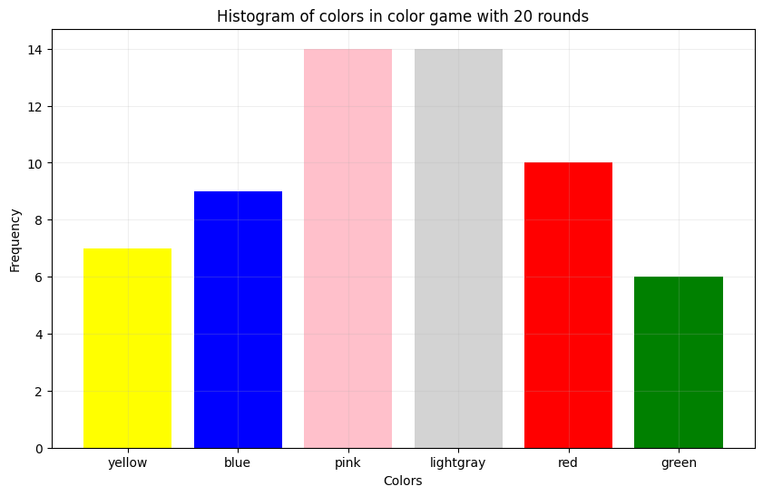
    


```python
rounds = 20
colors = ["blue", "red", "yellow", "lightgray", "pink", "green"]
color_collection = []

for i in range(rounds):
    random_outcome = random.choices(colors, k=3)
    for col in random_outcome:
        color_collection.append(col)

data = Counter(color_collection)
colors = list(data.keys())
frequencies = list(data.values())

plt.figure(figsize=(10, 6), dpi=100)
plt.bar(colors, frequencies, color=colors)
plt.xticks(ticks=range(len(colors)), labels=colors)
plt.xlabel("Colors")
plt.ylabel("Frequency")
plt.grid(True, alpha = 0.2)
plt.title(f"Histogram of colors in color game with {rounds} rounds")
```


    Text(0.5, 1.0, 'Histogram of colors in color game with 20 rounds')


    
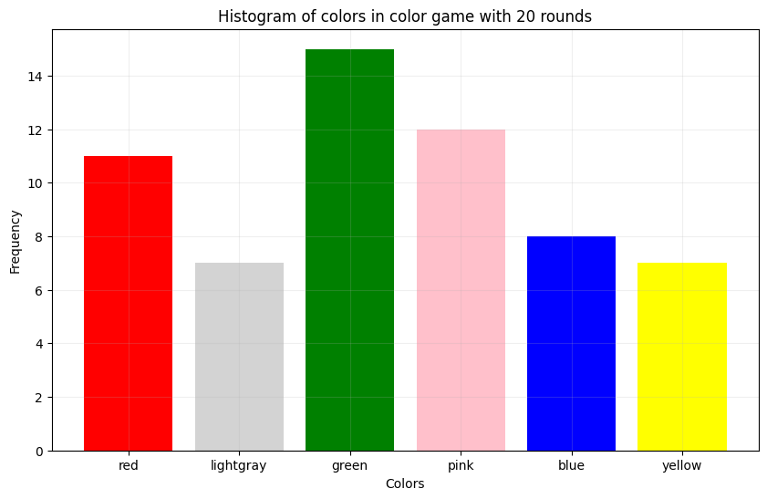
    


```python
rounds = 50
colors = ["blue", "red", "yellow", "lightgray", "pink", "green"]
color_collection = []

for i in range(rounds):
    random_outcome = random.choices(colors, k=3)
    for col in random_outcome:
        color_collection.append(col)

data = Counter(color_collection)
colors = list(data.keys())
frequencies = list(data.values())

plt.figure(figsize=(10, 6), dpi=100)
plt.bar(colors, frequencies, color=colors)
plt.xticks(ticks=range(len(colors)), labels=colors)
plt.xlabel("Colors")
plt.ylabel("Frequency")
plt.grid(True, alpha = 0.2)
plt.title(f"Histogram of colors in color game with {rounds} rounds")
```


    Text(0.5, 1.0, 'Histogram of colors in color game with 50 rounds')


    
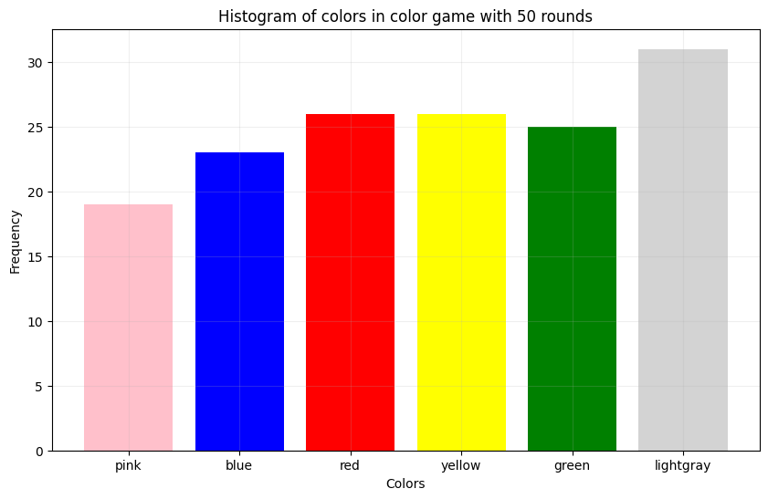
    


```python
rounds = 50
colors = ["blue", "red", "yellow", "lightgray", "pink", "green"]
color_collection = []

for i in range(rounds):
    random_outcome = random.choices(colors, k=3)
    for col in random_outcome:
        color_collection.append(col)

data = Counter(color_collection)
colors = list(data.keys())
frequencies = list(data.values())

plt.figure(figsize=(10, 6), dpi=100)
plt.bar(colors, frequencies, color=colors)
plt.xticks(ticks=range(len(colors)), labels=colors)
plt.xlabel("Colors")
plt.ylabel("Frequency")
plt.grid(True, alpha = 0.2)
plt.title(f"Histogram of colors in color game with {rounds} rounds")
```


    Text(0.5, 1.0, 'Histogram of colors in color game with 50 rounds')


    
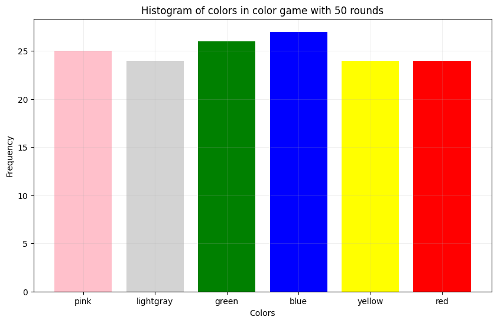
    


```python
rounds = 100000
colors = ["blue", "red", "yellow", "lightgray", "pink", "green"]
color_collection = []

for i in range(rounds):
    random_outcome = random.choices(colors, k=3)
    for col in random_outcome:
        color_collection.append(col)

data = Counter(color_collection)
colors = list(data.keys())
frequencies = list(data.values())

plt.figure(figsize=(10, 6), dpi=100)
plt.bar(colors, frequencies, color=colors)
plt.xticks(ticks=range(len(colors)), labels=colors)
plt.xlabel("Colors")
plt.ylabel("Frequency")
plt.grid(True, alpha = 0.2)
plt.title(f"Histogram of colors in color game with {rounds} rounds")
```


    Text(0.5, 1.0, 'Histogram of colors in color game with 100000 rounds')


    
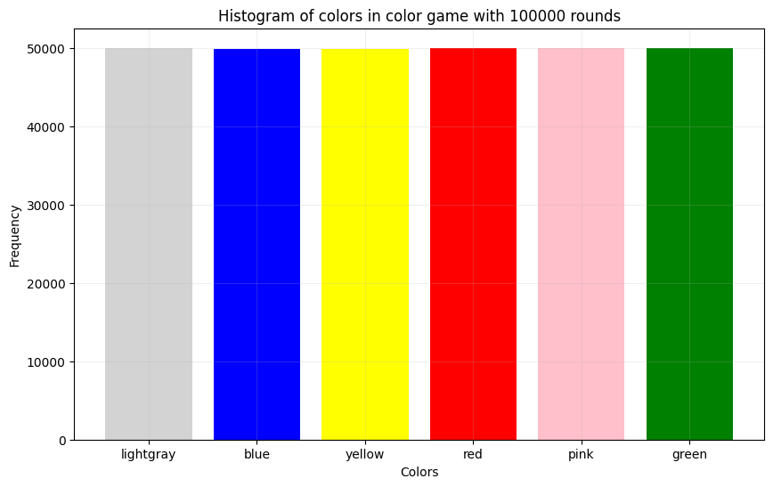
    


```python

```
